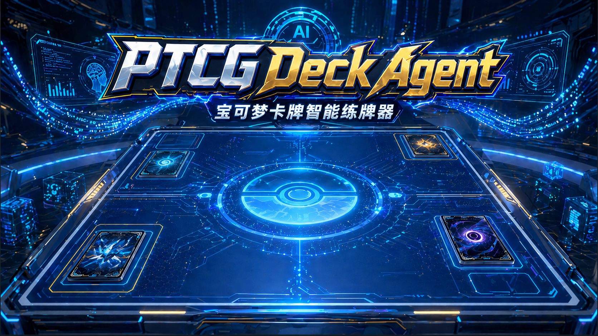
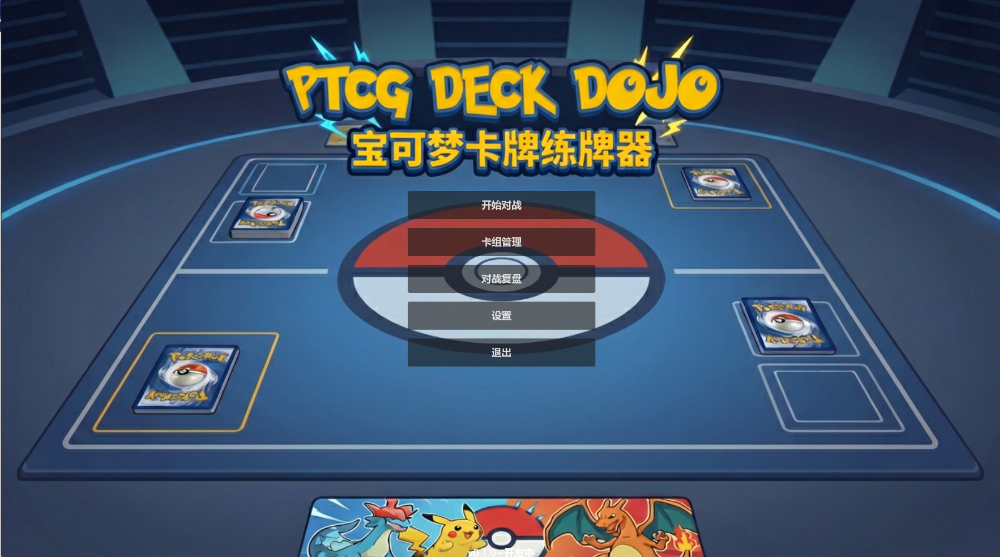
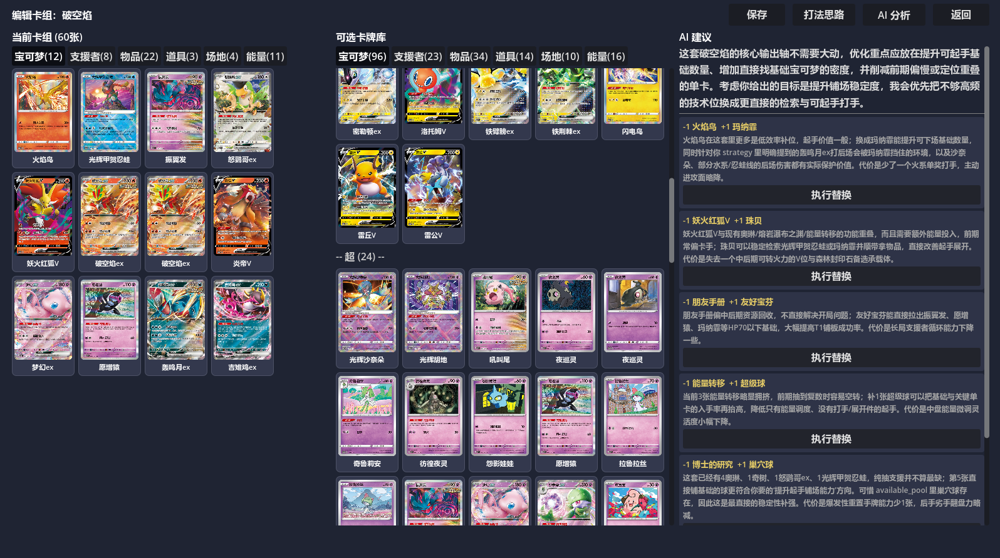
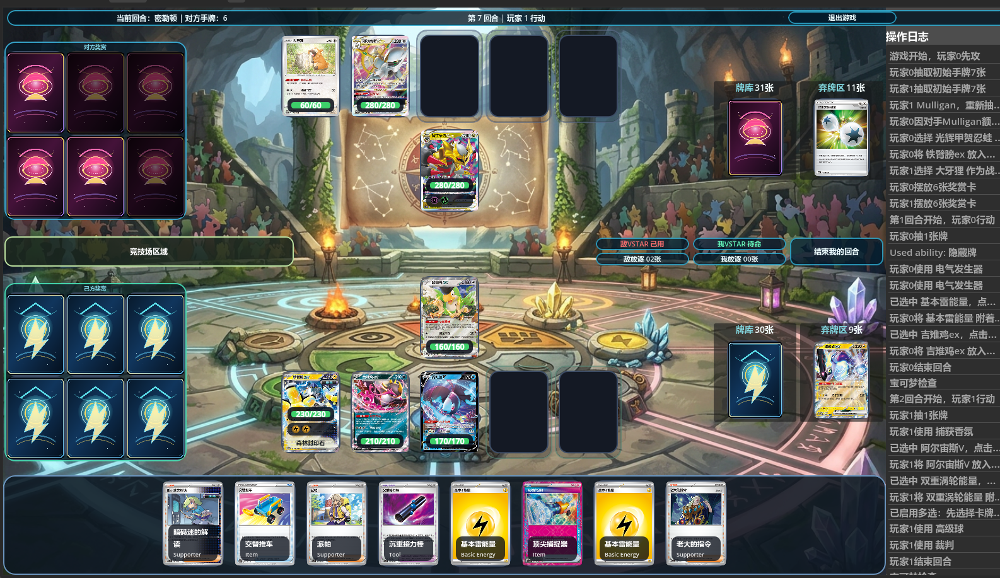
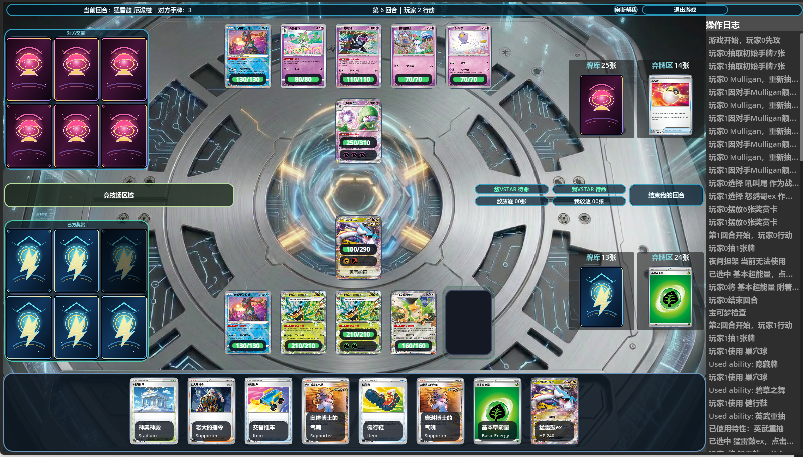

# PTCG Deck Agent

<p align="center">
  <a href="https://ptcg.skillserver.cn/">
    
  </a>
</p>

<p align="center">
  <strong>An AI-powered Pokemon TCG practice client for deck testing, live coaching, tournament practice, and rules-driven iteration.</strong>
</p>

<p align="center">
  <a href="https://ptcg.skillserver.cn/">Website</a>
  ·
  <a href="README.md">中文</a>
  ·
  <a href="docs/README.md">Docs</a>
  ·
  <a href="CONTRIBUTING.md">Contributing</a>
</p>

## What It Is

`PTCG Deck Agent` is a Godot 4.6 based local practice client for Pokemon TCG. The project has evolved from a rules-simulation sandbox into an AI-assisted training tool: import decks, play against rule-based or LLM-powered opponents, ask for live advice during games, review key turns, and continuously improve deck strategies through tests and match traces.

The goal is not to replace official products. The goal is to build a practical, transparent, and extensible training environment for players and developers who want to understand decks more deeply.

## Highlights

- **AI deck coach**: discuss a deck directly inside the deck editor, including opening stability, key-card odds, matchup plans, and card replacement decisions.
- **Live battle advice**: ask the AI what to do in the current position, including attacks, retreats, energy attachments, search targets, prize routes, and risk points.
- **Hidden-information guardrails**: battle advice is built from the current player's visible information and does not assume the opponent's hidden hand, deck order, or prize identities.
- **LLM opponent experiments**: includes experimental LLM-driven opponents such as Raging Bolt, connected to real turn planning instead of only post-game chat.
- **Rule-based AI decks**: bundled independent AI decks for common practice targets such as Miraidon, Charizard Pidgeot, Gardevoir, Arceus Giratina, Dragapult, and more.
- **Swiss tournament mode**: supports 16 / 32 / 64 / 128 player events with generated opponents, pairings, standings, and final rankings.
- **Bundled local assets**: decks, card data, card images, music, AI decks, and default configuration can be shipped with the game for a smoother first launch.
- **Regression-first development**: card effects, battle flow, AI behavior, scenario snapshots, and UI logic are covered by automated test entry points.

## AI Capabilities

### Deck Understanding

The assistant receives a compact full decklist plus key card text, so it can answer questions such as:

- What is this deck's main win condition?
- Which Basic Pokemon should I prioritize in the opening?
- Can this card be replaced by another card?
- How should I play this matchup?
- Which resources are missing or redundant?

### In-Battle Coaching

During a game, the AI prompt can include turn and phase, active player, board state, HP, attached energy, hand, discard pile, remaining prize count, and deck context. The prompt explicitly explains the Pokemon TCG prize rule: prize count means remaining prizes, and the first player to reach 0 wins.

### Review and Iteration

The project keeps infrastructure for match logs, decision traces, scenario snapshots, benchmarks, and strategy regression tests. Failed games can be inspected turn by turn to locate where the rule engine or AI strategy deviated from the intended deck plan.

## Preview

<p align="center">
  
  
</p>

<p align="center">
  
  
</p>

## Modes

- **Practice Battle**: choose a player deck and an AI deck for normal practice.
- **Local Two-Player Battle**: useful for manual rules validation and deck testing.
- **Deck Manager / Deck Editor**: import, edit, inspect, and discuss decks with AI.
- **Tournament Mode**: Swiss-style events with generated players, AI decks, standings, and final rankings.
- **AI Settings**: configure ZenMux API access, choose a supported model, test connectivity, and set the assistant's personality.

## Technical Layout

```text
assets/      UI art, backgrounds, audio, preview images
data/        Bundled decks, cards, images, AI fixed openings, default user assets
docs/        Architecture docs, development plans, strategy-iteration notes
scenes/      Godot scenes and UI scripts
scripts/     Rule engine, AI strategy, effect system, networking, tournament logic
tests/       Functional, card-effect, AI-strategy, and scenario regression tests
```

Core layers:

1. `scripts/engine/` handles rules, state transitions, effect scheduling, and snapshots.
2. `scripts/effects/` implements card, attack, ability, trainer, tool, and stadium effects.
3. `scripts/ai/` contains rule-based strategies, LLM decision bridges, and trace tooling.
4. `scripts/network/` handles ZenMux / OpenAI-compatible model requests.
5. `scripts/tournament/` implements Swiss tournament flow.

## Running Locally

### Requirements

- Godot `4.6.x`
- Windows is the most tested platform
- macOS packaging support is being improved
- ZenMux API key is required for AI chat / LLM features

### Start

1. Open `project.godot` with Godot.
2. Run `res://scenes/main_menu/MainMenu.tscn`.
3. Configure and test a model in `AI Settings`.
4. Start from deck management, practice battle, or tournament mode.

### Tests

```powershell
# Functional regression
& 'D:\ai\godot\Godot_v4.6.1-stable_win64_console.exe' --headless --path 'D:\ai\code\ptcgtrain' -s 'res://tests/FunctionalTestRunner.gd'

# AI / strategy tests
& 'D:\ai\godot\Godot_v4.6.1-stable_win64_console.exe' --headless --path 'D:\ai\code\ptcgtrain' -s 'res://tests/AITrainingTestRunner.gd'
```

## Status

This is an actively evolving open-source project. It already supports deck import, editing, playable battles, AI discussion, tournament mode, and many automated tests, but it should not be treated as a complete official judge.

The current positioning is:

- For players: a practical AI-assisted practice client.
- For developers: an experimental platform combining PTCG rules, AI strategy, LLM decisions, and regression testing.
- For contributors: a project that can keep improving through card fixes, tests, UI polish, and strategy work.

## Disclaimer

This is an unofficial, non-commercial learning and research project. Pokemon, Pokemon TCG, card names, images, rules text, and related intellectual property belong to their respective owners. This project is not endorsed by or affiliated with the official rights holders.

## Contributing

Issues and pull requests are welcome, especially for:

- Rule bugs and incorrect card effects
- Bad AI decisions in real games
- Deck strategy improvements and test cases
- UI / UX improvements
- Windows / macOS packaging feedback

Please read:

- [CONTRIBUTING.md](CONTRIBUTING.md)
- [DEVELOPMENT_SPEC.md](DEVELOPMENT_SPEC.md)
- [docs/README.md](docs/README.md)

## License

[Apache License 2.0](LICENSE)
